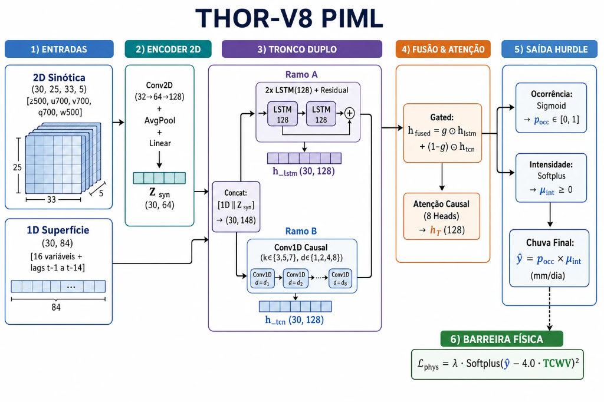

# THOR-PIML: Arquitetura Neural Híbrida com Física Informada para Modelagem e Downscaling Estatístico de Precipitação em Bacias Hidrográficas Regionais

[](https://github.com/Zentsy/THOR-PIML-Conic2026)
[](LICENSE)
[](https://www.python.org/)
[](https://pytorch.org/)

> **Repositório Oficial do Artigo:**  
> *"THOR-PIML: Arquitetura Neural Híbrida com Física Informada para Modelagem e Downscaling Estatístico de Precipitação em Bacias Hidrográficas Regionais"*  
> **THOR-PIML:** *Taylor-Hurdle Optimized Regional Physics-Informed Machine Learning*  
> Submetido ao **CONIC 2026** (Categoria: Concluído).

---

## 📌 Material Suplementar

> [!IMPORTANT]
> **Aos Avaliadores do CONIC 2026 e Pesquisadores:**  
> O detalhamento matemático das formulações, deduções das funções de perda, protocolo experimental e análise exaustiva das figuras encontram-se descritos no **Material Suplementar Oficial**:  
> 📄 **[`docs/SUPPLEMENTARY_MATERIAL.md`](docs/SUPPLEMENTARY_MATERIAL.md)**

---

## 🔬 Arquitetura do Modelo (THOR-V8 PIML)

A arquitetura **THOR-V8 PIML** articula o processamento conjunto de campos sinóticos bidimensionais em altitude e séries temporais de superfície ao longo de uma janela móvel de 30 dias:

<p align="center">
  
</p>

### Módulos Sequenciais de Processamento:

1. **Entradas Multimodais ($T = 30$ dias):**
   - **Campo Sinótico 2D (ERA5-PL):** Tensor $(30, 25, 33, 5)$ integrando as variáveis $z_{500}, u_{700}, v_{700}, q_{700}, w_{500}$.
   - **Preditores de Superfície 1D (ERA5-Land):** Tensor $(30, 84)$ contendo 16 variáveis locais mais 80 *lags* temporais ($t-1$ a $t-14$).

2. **Encoder Convolucional 2D:**
   Blocos $\text{Conv2D} (32 \to 64 \to 128)$ com *Average Pooling* e projeção linear para extrair a representação latente sinótica:

$$
Z_{\text{syn}} \in \mathbb{R}^{30 \times 64}
$$

3. **Tronco Duplo Paralelo ($30 \times 148$):**
   Concatenação $[\text{1D} \parallel Z_{\text{syn}}]$ processada simultaneamente pelo **Ramo A** ($2\times \text{LSTM}(128) + \text{Residual}$) para inércia de solo, e pelo **Ramo B** ($\text{Conv1D Causal}$ multi-escala com $k \in \{3,5,7\}$ e dilatações $d \in \{1,2,4,8\}$) para transientes e frentes frias.

4. **Fusão Adaptativa & Autoatenção:**
   Combinação dinâmica por portão aprendido (*Gated Fusion*):

$$
h_{\text{fused}} = g \odot h_{\text{lstm}} + (1 - g) \odot h_{\text{tcn}}
$$

   seguida por camada de **Autoatenção Causal** com 8 cabeças (SDPA) gerando o vetor de estado refinado $h_T \in \mathbb{R}^{128}$.

5. **Decodificador Hurdle Dual-Head:**
   Bifurcação estocástica em uma **Cabeça de Ocorrência** ($\text{Sigmoid} \to p_{\text{occ}} \in [0, 1]$) e uma **Cabeça de Intensidade** ($\text{Softplus} \to \mu_{\text{int}} \ge 0$), definindo a precipitação contínua diária estimada:

$$
\hat{y} = p_{\text{occ}} \times \mu_{\text{int}} \quad (\text{mm/dia})
$$

6. **Barreira Física Termodinâmica (PIML):**
   Restrição termodinâmica diferenciável de Clausius-Clapeyron ancorada na coluna total de vapor de água ($TCWV$ real):

$$
\mathcal{L}_{\text{phys}} = \lambda \cdot \left[\text{Softplus}\left(\hat{y} - 4{,}0 \cdot TCWV\right)\right]^2
$$

   garantindo **0,00% de violações físicas** em todo o período simulado.

---

## 📊 Benchmark Oficial no Teste Cego (2019–2026, $N = 2.494$ dias)

Avaliação comparativa rigorosa no conjunto de teste cego independente de 7 anos (dados observacionais CHIRPS 5,5 km vs. ERA5):

| Modelo / Abordagem | Paradigma | KGE (↑) | NSE (↑) | RMSE (mm/d) | MAE (mm/d) | Bias (mm/d) | R10mm (Acerto) | R20mm (Tempestades) | Violação Física |
| :--- | :--- | :---: | :---: | :---: | :---: | :---: | :---: | :---: | :---: |
| **Observado (CHIRPS Real)** | *Ground Truth* | 1.0000 | 1.0000 | 0.00 | 0.00 | 0.00 | 288 dias | 100 dias | 0.00% |
| **EQM (Gudmundsson 2012)** | Mapeamento Quantílico | +0.0624 | -0.9879 | 9.31 | 4.19 | +1.56 | 425 dias | 206 dias | 0.00% |
| **ResLSTM (Kratzert 2018)** | Recorrente Residual | +0.1603 | -0.3013 | 7.53 | 4.62 | +1.87 | 544 dias | 97 dias | N/A |
| **TCN Pura (Bai 2018)** | Convolucional Temporal | +0.2383 | -0.3418 | 7.64 | 4.41 | +0.70 | 380 dias | 92 dias | N/A |
| **THOR-V7 Híbrido** | Fusão LSTM+TCN | +0.3200 | -0.0939 | 6.90 | 4.03 | +1.02 | 470 dias | 17 dias | 0.00% |
| **THOR-V8 PIML (Master)** | **2D CNN + Híbrido PIML** | **+0.4101** 🏆 | **-0.0336** 🏆 | **6.71** 🏆 | **3.44** 🏆 | **+0.14** 🏆 | **279 dias** 🏆 | **95 dias** 🏆 | **0.00%** 🏆 |

---

## 🚀 Reprodução em 1 Comando

Para executar o benchmark completo e reproduzir todas as 5 figuras e tabelas do artigo científico:

```bash
# 1. Clonar o repositório
git clone https://github.com/Zentsy/THOR-PIML-Conic2026.git
cd THOR-PIML-Conic2026

# 2. Instalar dependências
pip install -r requirements.txt

# 3. Executar a reprodução automatizada
python reproduce_paper_results.py
```

Os checkpoints pré-treinados estão disponíveis em `checkpoints/` e os resultados e figuras são salvos em `results/`.

---

## 📂 Estrutura do Repositório

```text
THOR-PIML-Conic2026/
├── checkpoints/              # Checkpoints pré-treinados (.pt) e scalers
│   ├── v8_hybrid_seed42.pt   # Modelo campeão oficial THOR-V8 PIML
│   ├── v7_hybrid_v7_v3_seed42.pt
│   ├── v7_lstm_v7_v3_seed42.pt
│   └── v7_tcn_v7_v3_seed42.pt
├── data/                     # Dataset oficial de treino e teste cego
│   └── ground_truth_guarulhos_daily_v3.csv
├── docs/                     # Material Suplementar oficial (SUPPLEMENTARY_MATERIAL.md)
├── results/                  # Tabela do benchmark e saídas
│   └── figures/              # Figuras oficiais em alta resolução (300 DPI)
├── src/                      # Código-fonte PyTorch das arquiteturas e perdas PIML
├── reproduce_paper_results.py # Script de avaliação e benchmark oficial
└── requirements.txt          # Dependências pinadas (PyTorch 2.4.0)
```

---

## 📜 Licença

Uso estritamente acadêmico sob a **[Restricted Academic Evaluation & Research License](LICENSE)**. Proibido qualquer uso comercial ou governamental/estatal sem autorização formal prévia dos autores.
