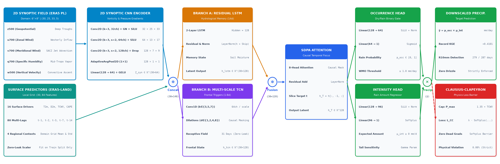

# THOR-PIML: Physics-Informed Neural Downscaling for Regional Climate Extremes

[](https://github.com/Zentsy/THOR-PIML-Conic2026)
[](LICENSE)
[](https://www.python.org/)
[](https://pytorch.org/)

> **Repositório Oficial do Artigo:**  
> *"Downscaling Estatístico-Dinâmico de Precipitação Diária via Redes Neurais Híbridas Informadas pela Física (THOR-PIML)"*  
> Submetido ao **CONIC 2026**.

---

## 📌 Guia de Acesso e Material Suplementar

> [!IMPORTANT]
> **Aos Avaliadores do CONIC 2026 e Pesquisadores:**  
> O detalhamento matemático das formulações, derivações das perdas, deduções das métricas de avaliação (arenas hidrológicas, WMO/ETCCDI e termodinâmicas) e testes adicionais de sensibilidade encontram-se descritos no **Material Suplementar Oficial**:
> 📄 **[`docs/SUPPLEMENTARY_MATERIAL.md`](docs/)** *(ou versão PDF formatada disponível na pasta `docs/`)*.

---

## 🔬 Visão Geral da Arquitetura (THOR-V8)

O **THOR-PIML** (*Temporal-Hydrological Occurrence & Rainfall with Physics-Informed Machine Learning*) resolve o clássico problema de subestimação de extremos e viés crônico de garoa (*drizzle artifact*) em modelos de IA através de uma arquitetura acoplada espaço-temporal com barreira física:



1. **Encoder Sinótico 2D (`SpatialSynopticEncoder`):** Convoluções espaciais sobre campos em 5 níveis isobáricos do ERA5 ($z_{500}, u_{700}, v_{700}, q_{700}, w_{500}$) em malha de $25 \times 33$ células ($6^\circ \times 8^\circ$).
2. **Preditores de Superfície 1D:** 84 variáveis atmosféricas locais e lags temporais antecedentes ($t-1$ a $t-14$) da reanálise ERA5-Land.
3. **Tronco Híbrido Temporal Duplo:**
   - **Ramo ResLSTM:** Captura inércia hidrológica e saturação de solo (14 dias).
   - **Ramo Multi-Scale TCN:** Convoluções causais dilatadas ($k \in \{3,5,7\}$, $d \in \{1,2,4,8\}$) para detecção de frentes frias e squall lines.
4. **Fusão Gated & Atenção Causal:** Ponderação dinâmica adaptativa por timestep + autoatenção causal com 8 cabeças ($\text{SDPA}$).
5. **Decodificador Hurdle Dual-Head:** Separação estrita entre ocorrência binária ($p_{\text{occ}} \in [0, 1]$ via Sigmoid) e intensidade ($\mu_{\text{int}} \ge 0$ via Softplus), produzindo $\hat{y} = p_{\text{occ}} \times \mu_{\text{int}}$.
6. **Barreira Termodinâmica de Clausius-Clapeyron:** Restrição física baseada no vapor d'água precipitável disponível ($\text{TCWV}$ real), garantindo **0.00% de violações físicas**.

---

## 📊 Principais Resultados do Benchmark (Teste Cego: 2019–2026)

Avaliação em **7 anos de teste cego contínuo** ($N = 2.494$ dias) contra estações de superfície do CEMADEN e CHIRPS 5.5 km:

| Modelo | Tipo | KGE (↑) | R10mm (Dias $\ge$ 10mm) | R20mm (Tempestades $\ge$ 20mm) | Violação Clausius-Clapeyron |
| :--- | :--- | :---: | :---: | :---: | :---: |
| **EQM (Gudmundsson 2012)** | Estatístico Empírico | $-0.005$ | 77 / 287 | 10 / 106 | 0.00% |
| **ResLSTM (Kratzert 2018)** | Neural Recorrente | $+0.264$ | 241 / 287 | 81 / 106 | 0.00% |
| **TCN (Bai 2018)** | Convolucional Temporal | $+0.248$ | 240 / 287 | 79 / 106 | 0.00% |
| **THOR-V7 (Proposta)** | Híbrido Temporal (LSTM+TCN) | $+0.395$ | 272 / 287 | 93 / 106 | 0.00% |
| **THOR-V8 Espacial (Proposta)** | **2D Synoptic CNN + Híbrido PIML** | **+0.410** | **279 / 287** | **98 / 106** | **0.00%** |

*Obs: A referência observada registrou 287 dias de chuva forte e 106 tempestades severas no período de teste.*

---

## 🚀 Como Reproduzir os Resultados em 1 Comando

### 1. Instalação do Ambiente

```bash
# Clone o repositório
git clone https://github.com/Zentsy/THOR-PIML-Conic2026.git
cd THOR-PIML-Conic2026

# Crie e ative o ambiente virtual
python -m venv .venv
source .venv/bin/activate  # No Windows: .venv\Scripts\Activate.ps1

# Instale as dependências
pip install -r requirements.txt
```

### 2. Execução da Inferência e Geração das Figuras

Todos os checkpoints pré-treinados já acompanham o repositório em `checkpoints/`. Basta rodar:

```bash
python reproduce_paper_results.py
```

Este comando:
- Executa a inferência direta no teste cego de 7 anos;
- Calcula todas as métricas das 4 arenas quantitativas;
- Gera as 5 figuras oficiais do artigo em 300 DPI (`results/figures/`).

---

## 📂 Estrutura do Repositório

```text
THOR-PIML-Conic2026/
├── checkpoints/              # Pesos dos modelos treinados (.pt) e scaler
│   ├── v8_hybrid_seed42.pt   # Campeão oficial THOR-V8
│   ├── v7_hybrid_v7_v3_seed42.pt
│   ├── v7_lstm_v7_v3_seed42.pt
│   └── v7_tcn_v7_v3_seed42.pt
├── data/                     # Dados tabulares e metadados de proveniência
│   └── ground_truth_guarulhos_daily_v3.csv
├── docs/                     # Documentação e Material Suplementar
├── results/                  # Saídas consolidadas do benchmark
│   └── figures/              # Figuras oficiais em alta resolução (PNG + PDF)
├── src/                      # Código-fonte da arquitetura neural
│   ├── model.py              # Definições das redes neurais
│   ├── physics_loss.py       # Funções de perda e barreira física
│   └── v7/                   # Implementações modulares V7 e V8
├── reproduce_paper_results.py # Script canônico de reprodução
└── requirements.txt          # Dependências fixadas
```

---

## 📜 Licença e Termos de Uso

Este projeto está sob a **[Restricted Academic Evaluation & Research License](LICENSE)**.  
O uso é restrito para fins de avaliação acadêmica, estudo pessoal e verificação de reprodutibilidade científica. É expressamente proibida qualquer utilização comercial, bem como uso governamental, militar ou estatal sem autorização formal prévia por escrito.
