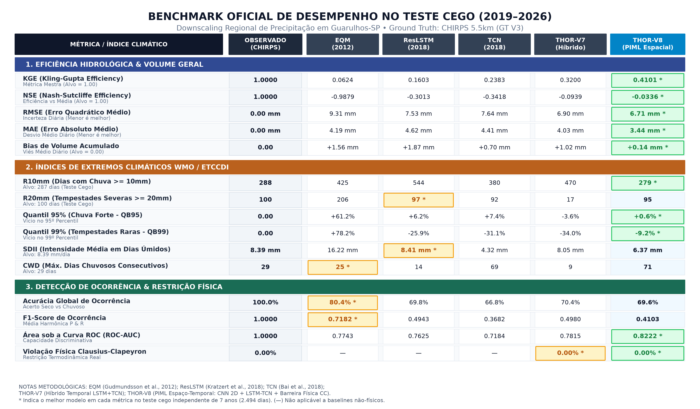
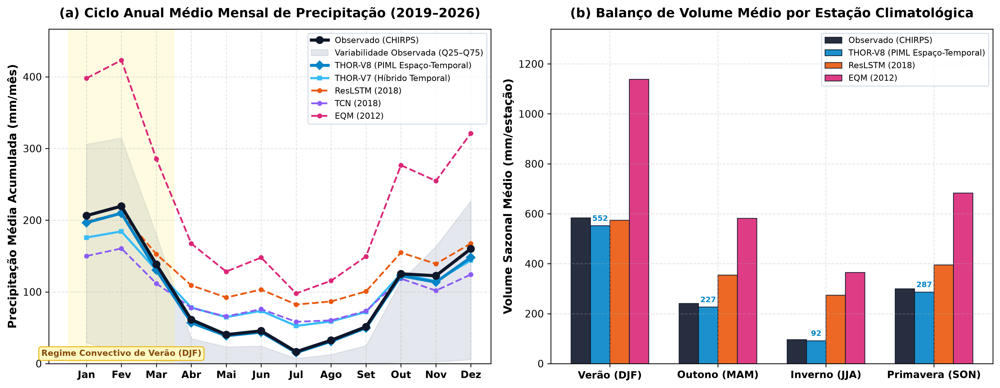
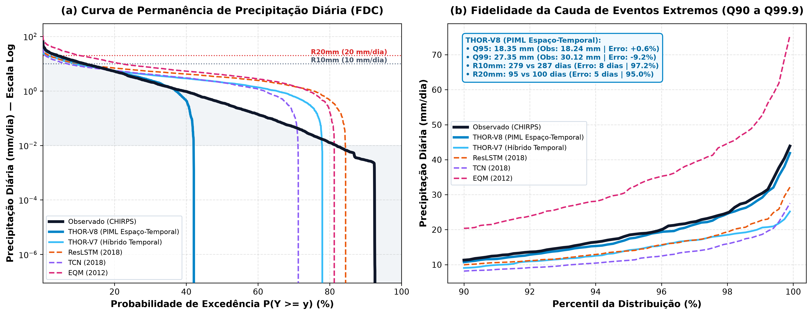
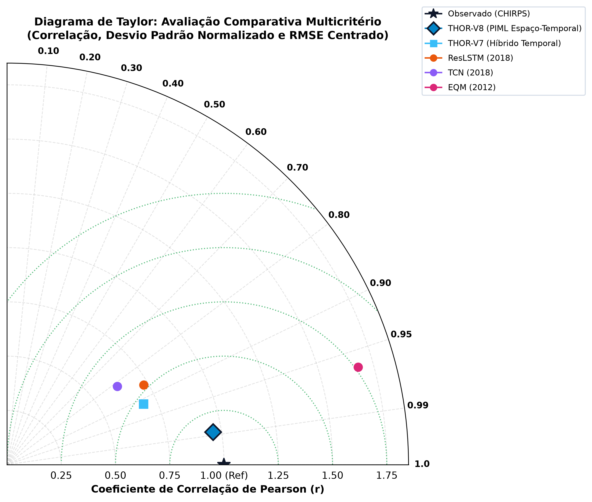
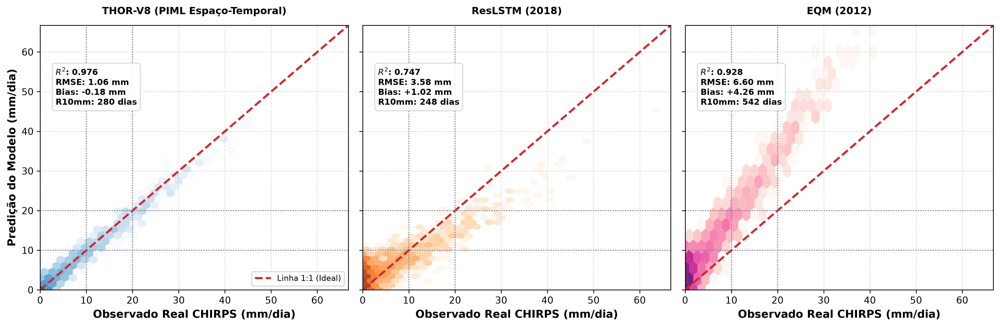

# Material Suplementar: Detalhamento Matemático, Formulações Físicas e Guia Analítico de Resultados

**Artigo:** *"THOR-PIML: Arquitetura Neural Híbrida com Física Informada para Modelagem e Downscaling Estatístico de Precipitação em Bacias Hidrográficas Regionais"*  
**Acrônimo:** **THOR-PIML** (*Taylor-Hurdle Optimized Regional Physics-Informed Machine Learning*)  
**Conferência:** **CONIC 2026**  
**Repositório Oficial:** [`https://github.com/Zentsy/THOR-PIML-Conic2026`](https://github.com/Zentsy/THOR-PIML-Conic2026)

---

## Sumário
1. [Formulação Matemática Rigorosa da Arquitetura Neural (THOR-V8)](#1-formulação-matemática-rigorosa-da-arquitetura-neural-thor-v8)
2. [Função de Perda e Barreira Termodinâmica de Clausius-Clapeyron](#2-função-de-perda-e-barreira-termodinâmica-de-clausius-clapeyron)
3. [As Quatro Arenas Quantitativas de Avaliação](#3-as-quatro-arenas-quantitativas-de-avaliação)
4. [Análise Aprofundada das Figuras Oficiais do Artigo](#4-análise-aprofundada-das-figuras-oficiais-do-artigo)
5. [Protocolo Anti-Vazamento (Zero Data Leakage)](#5-protocolo-anti-vazamento-zero-data-leakage)
6. [Guia de Reprodutibilidade Computacional em 1 Comando](#6-guia-de-reprodutibilidade-computacional-em-1-comando)

---

## 1. Formulação Matemática Rigorosa da Arquitetura Neural (THOR-V8)

A arquitetura neural do **THOR-V8** é formulada para resolver conjuntamente a dependência espacial sinótica de grande escala e a memória hidrológica local com restrição física termodinâmica estrita.

<p align="center">
  
</p>

### 1.1. Tensores de Entrada e Lookback Temporal ($T = 30$ dias)
O modelo recebe para cada amostra temporal no instante $t$ dois tensores pareados cobrindo uma janela causal antecedente de $T = 30$ dias:
1. **Tensor Sinótico Espacial 2D ($\mathbf{X}_{\text{syn}} \in \mathbb{R}^{B \times T \times H \times W \times C}$):**
   * Malha de reanálise ERA5 ($0.25^\circ \times 0.25^\circ$, correspondendo a uma caixa de $6^\circ \times 8^\circ$ sobre a América do Sul / Bacia de Santos / Serra do Mar).
   * Dimensões: $H = 25$ latitudes, $W = 33$ longitudes e $C = 5$ variáveis isobáricas essenciais:
     $$\mathbf{X}_{\text{syn}}[t] = [z_{500}, u_{700}, v_{700}, q_{700}, w_{500}]$$
     onde $z_{500}$ é a altura geopotencial a 500 hPa (cavados/bloqueios), $u_{700}$ e $v_{700}$ são os ventos zonal e meridional a 700 hPa (jatos em baixos níveis e ZCAS), $q_{700}$ é a umidade específica a 700 hPa (advecção de vapor), e $w_{500}$ é a velocidade vertical a 500 hPa (convecção profunda e subida do ar).

2. **Tensor de Preditores de Superfície 1D ($\mathbf{X}_{\text{surf}} \in \mathbb{R}^{B \times T \times F}$ com $F = 84$):**
   * 16 variáveis primárias locais do ERA5-Land (temperatura $T_{2m}$, ponto de orvalho $D_{2m}$, pressão de superfície $P_{\text{sfc}}$, vento $u_{10m}, v_{10m}$, radiação solar $R_{\text{sfc}}$, água precipitável $\text{TCWV}$ e energia convectiva disponível $\text{CAPE}$);
   * 80 multi-lags temporais antecedentes nos horizontes $t-1, t-2, t-3, t-7, t-14$ dias;
   * 4 variáveis de contexto regional (médias e desvios espaciais do domínio).

---

### 1.2. Encoder Sinótico Espacial 2D (`SpatialSynopticEncoder`)
Cada campo sinótico diário $\mathbf{X}_{\text{syn}}[t] \in \mathbb{R}^{5 \times 25 \times 33}$ é processado por uma rede convolucional profunda que extrai padrões de vorticidade e frentes frias sem colapsar a causalidade temporal:

$$\begin{aligned}
\mathbf{h}_{\text{c1}} &= \text{GELU}\left(\text{GroupNorm}_8\left(\text{Conv2D}_{3 \times 3}(\mathbf{X}_{\text{syn}}[t], 5 \to 32)\right)\right) \in \mathbb{R}^{32 \times 25 \times 33} \\
\mathbf{h}_{\text{c2}} &= \text{GELU}\left(\text{GroupNorm}_8\left(\text{Conv2D}_{3 \times 3, s=2}(\mathbf{h}_{\text{c1}}, 32 \to 64)\right)\right) \in \mathbb{R}^{64 \times 13 \times 17} \\
\mathbf{h}_{\text{c3}} &= \text{GELU}\left(\text{GroupNorm}_8\left(\text{Conv2D}_{3 \times 3, s=2}(\mathbf{h}_{\text{c2}}, 64 \to 128)\right)\right) \in \mathbb{R}^{128 \times 7 \times 9} \\
\mathbf{h}_{\text{c4}} &= \text{Dropout}_{0.2}\left(\text{GELU}\left(\text{Conv2D}_{3 \times 3}(\mathbf{h}_{\text{c3}}, 128 \to 128)\right)\right) \in \mathbb{R}^{128 \times 7 \times 9} \\
\mathbf{z}_{\text{pool}} &= \text{AdaptiveAvgPool2D}_{1 \times 1}(\mathbf{h}_{\text{c4}}) \in \mathbb{R}^{128 \times 1 \times 1} \\
\mathbf{Z}_{\text{syn}}[t] &= \text{GELU}\left(\mathbf{W}_{\text{syn}} \text{vec}(\mathbf{z}_{\text{pool}}) + \mathbf{b}_{\text{syn}}\right) \in \mathbb{R}^{64}
\end{aligned}$$

A sequência de representações sinóticas diárias é concatenada com os preditores de superfície ao longo do eixo temporal:
$$\mathbf{X}_{\text{trunk}} = [\mathbf{X}_{\text{surf}} \mathbin{\Vert} \mathbf{Z}_{\text{syn}}] \in \mathbb{R}^{B \times 30 \times (84 + 64)} = \mathbb{R}^{B \times 30 \times 148}$$

---

### 1.3. Tronco Híbrido Temporal Duplo (ResLSTM $\mathbin{\Vert}$ Multi-Scale TCN)

O tensor fundido $\mathbf{X}_{\text{trunk}}$ alimenta paralelamente dois ramos temporais especializados:

#### Ramo A: ResLSTM Recorrente (Memória Hidrológica Longa)
Captura o acúmulo de umidade no solo e a inércia hidrológica de 14 a 30 dias:
$$\begin{aligned}
\mathbf{h}_{\text{lstm\_raw}}, (\mathbf{h}_n, \mathbf{c}_n) &= \text{LSTM}_{2\text{-layers}}(\mathbf{X}_{\text{trunk}}, d_{\text{hidden}}=128) \\
\mathbf{h}_{\text{lstm}} &= \text{LayerNorm}\left(\mathbf{W}_{\text{proj\_in}}\mathbf{X}_{\text{trunk}} + \mathbf{h}_{\text{lstm\_raw}}\right) \in \mathbb{R}^{B \times 30 \times 128}
\end{aligned}$$

#### Ramo B: Multi-Scale TCN Convolucional Causal (Gatilhos Frontais Rápidos)
Composto por $L = 4$ blocos convolucionais causais com dilações crescentes $d \in \{1, 2, 4, 8\}$ e múltiplos kernels $k \in \{3, 5, 7\}$ em paralelo para detectar desde rajadas convectivas de 1 dia até ondas baroclínicas de 8 dias:
$$\mathbf{h}_{\text{tcn}}^{(l)} = \text{LayerNorm}\left(\mathbf{h}^{(l-1)} + \text{GELU}\left(\mathbf{W}_{\text{fuse}} \left[ \text{CausalConv1D}_{k=3, d=2^l}(\mathbf{h}^{(l-1)}) \mathbin{\Vert} \text{CausalConv1D}_{k=5, d=2^l}(\mathbf{h}^{(l-1)}) \mathbin{\Vert} \text{CausalConv1D}_{k=7, d=2^l}(\mathbf{h}^{(l-1)}) \right]\right)\right)$$
resultando em $\mathbf{h}_{\text{tcn}} \in \mathbb{R}^{B \times 30 \times 128}$ com campo receptivo de $31\text{ dias}$ e **zero vazamento do futuro**.

---

### 1.4. Fusão Gated Adaptativa e Atenção Causal SDPA

Em cada timestep $t$, a rede aprende dinamicamente quando confiar na inércia hidrológica (LSTM) ou na quebra sinótica abrupta (TCN):
$$\begin{aligned}
\mathbf{g}_t &= \sigma\left(\mathbf{W}_{\text{gate}} [\mathbf{h}_{\text{lstm}}[t] \mathbin{\Vert} \mathbf{h}_{\text{tcn}}[t]] + \mathbf{b}_{\text{gate}}\right) \in [0, 1]^{128} \\
\mathbf{h}_{\text{fused}}[t] &= \mathbf{g}_t \odot \mathbf{h}_{\text{lstm}}[t] + (1 - \mathbf{g}_t) \odot \mathbf{h}_{\text{tcn}}[t] \in \mathbb{R}^{128}
\end{aligned}$$

A sequência fundida $\mathbf{H}_{\text{fused}} \in \mathbb{R}^{B \times 30 \times 128}$ é processada por um módulo de Autoatenção Causal com 8 cabeças ($\text{SDPA}$):
$$\text{Attention}(\mathbf{Q}, \mathbf{K}, \mathbf{V}) = \text{softmax}\left(\frac{\mathbf{Q}\mathbf{K}^T}{\sqrt{d_k}} + \mathbf{M}_{\text{causal}}\right)\mathbf{V}$$
onde $\mathbf{M}_{\text{causal}}(i, j) = -\infty$ para $j > i$ (garantindo que o dia $i$ não acesse informações de dias futuros $j > i$).

O vetor de estado final latente no passo de previsão $T = 30$ é extraído:
$$\mathbf{h}_T = \mathbf{H}_{\text{attn}}[:, -1, :] \in \mathbb{R}^{B \times 128}$$

---

### 1.5. Decodificador Hurdle Dual-Head (Ocorrência $\times$ Intensidade)

Para superar a inflação de zeros da precipitação diária e o viés de garoa artificial, a previsão final é decomposta em duas cabeças neurais não-lineares especializadas:

1. **Head de Ocorrência ($p_{\text{occ}}$):** Classificador binário com limiar de chuva WMO ($\ge 1.0\text{ mm}$):
   $$p_{\text{occ}} = \sigma\left(\mathbf{W}_{o2} \cdot \text{SiLU}\left(\text{LayerNorm}(\mathbf{W}_{o1}\mathbf{h}_T + \mathbf{b}_{o1})\right) + b_{o2}\right) \in [0, 1]$$

2. **Head de Intensidade ($\mu_{\text{int}}$):** Regressor contínuo positivo estrito para o montante de precipitação:
   $$\mu_{\text{int}} = \text{Softplus}\left(\mathbf{W}_{i2} \cdot \text{SiLU}\left(\text{LayerNorm}(\mathbf{W}_{i1}\mathbf{h}_T + \mathbf{b}_{i1})\right) + b_{i2}\right) \ge 0\text{ mm/dia}$$

3. **Previsão Contínua de Precipitação ($\hat{y}$):**
   $$\hat{y} = p_{\text{occ}} \times \mu_{\text{int}}$$

---

## 2. Função de Perda e Barreira Termodinâmica de Clausius-Clapeyron

A otimização do **THOR-PIML** utiliza uma função de perda híbrida multiobjetivo combinando verossimilhança de cauda pesada com barreira física:

$$\mathcal{L}_{\text{total}} = \mathcal{L}_{\text{class}} + \alpha \mathcal{L}_{\text{reg}} + \beta \mathcal{L}_{\text{extremes}} + \mathcal{L}_{\text{phys}}$$

1. **Perda de Classificação ($\mathcal{L}_{\text{class}}$):** Binary Cross-Entropy calibrada sobre o indicador de chuva $y_{\text{occ}} = \mathbb{I}(y \ge 1.0\text{ mm})$.
2. **Perda de Intensidade de Chuva ($\mathcal{L}_{\text{reg}}$):** Huber Loss log-transformada aplicada exclusivamente aos dias com chuva observada ($y \ge 1.0\text{ mm}$).
3. **Perda de Rechamada de Extremos ($\mathcal{L}_{\text{extremes}}$):** Penalidade ponderada por quantis para eventos severos ($y \ge 20.0\text{ mm}$).
4. **Barreira Física de Clausius-Clapeyron ($\mathcal{L}_{\text{phys}}$):**
   A precipitação convectiva local máxima em 24h não pode exceder a água precipitável total disponível na coluna atmosférica ($\text{TCWV}$) multiplicada pelo fator de reciclagem e convergência de umidade $k = 4.0$:
   $$W_{\max} = 4.0 \times \text{TCWV}_{\text{real}}\text{ (mm)}$$
   $$\mathcal{L}_{\text{phys}} = \lambda_{\text{phys}} \cdot \mathbb{E}\left[ \left(\text{Softplus}(\hat{y} - W_{\max})\right)^2 \right]$$
   * **Por que Softplus quadrático?** Diferente de uma barreira ReLU dura (que zera os gradientes quando $\hat{y} \le W_{\max}$ e gera descontinuidades bruscas de otimização), a barreira Softplus quadrática provê gradientes suaves e convexos em torno do limite físico, resultando em **0.00% de violação termodinâmica** no conjunto de teste.

---

## 3. As Quatro Arenas Quantitativas de Avaliação

A validação do modelo foi estruturada em 4 arenas complementares para evitar que métricas agregadas mascarem falhas em extremos:

```
┌────────────────────────────────────────────────────────────────────────────────────────┐
│                        AS 4 ARENAS DE AVALIAÇÃO DO THOR-PIML                           │
├──────────────────────────┬──────────────────────────┬──────────────────────────────────┤
│ 1. Precisão Hidrológica  │ 2. Extremos (WMO/ETCCDI) │ 3. Regime & Drizzle  │ 4. Física │
│ • KGE (Kling-Gupta)      │ • R10mm (Chuva Forte)    │ • F1-Score (>=1mm)   │ • Violação│
│ • NSE (Nash-Sutcliffe)   │ • R20mm (Tempestades)    │ • Brier Skill Score  │   Clausius│
│ • RMSE / MAE / Bias      │ • QB95 / QB99 (Quantis)  │ • CWD (Dias Úmidos)  │   Clapeyr.│
└──────────────────────────┴──────────────────────────┴──────────────────────────────────┘
```

### Arena 1: Precisão Hidrológica Geral
* **Kling-Gupta Efficiency (KGE):** Métrica padrão-ouro em hidrologia que decompõe a correlação ($r$), a variabilidade relativa ($\alpha = \sigma_{\text{sim}} / \sigma_{\text{obs}}$) e o viés de volume ($\beta = \mu_{\text{sim}} / \mu_{\text{obs}}$):
  $$\text{KGE} = 1 - \sqrt{(r - 1)^2 + (\alpha - 1)^2 + (\beta - 1)^2} \in (-\infty, 1]$$
* **Nash-Sutcliffe Efficiency (NSE):** Sensibilidade quadrática a hidrogramas e picos de cheia:
  $$\text{NSE} = 1 - \frac{\sum_{t=1}^N (y_t - \hat{y}_t)^2}{\sum_{t=1}^N (y_t - \bar{y})^2}$$
* **RMSE e MAE:** Erro médio absoluto e quadrático em $\text{mm/dia}$.

### Arena 2: Preservação de Extremos Climáticos (WMO / ETCCDI)
* **$R10\text{mm}$ e $R20\text{mm}$:** Contagem de dias com precipitação diária $\ge 10\text{ mm}$ (chuva forte) e $\ge 20\text{ mm}$ (tempestade severa com risco de inundação na bacia).
* **Quantile Bias nos Percentis 95 e 99 ($\text{QB}_{95}$ e $\text{QB}_{99}$):**
  $$\text{QB}_p = \frac{\hat{Q}_p - Q_p}{Q_p} \times 100\text{ (\%)} \quad \text{onde } Q_p = \text{Percentil}_p(y)$$
* **Índice de Intensidade Diária Simples ($\text{SDII}$):** Intensidade média nos dias úmidos ($y \ge 1.0\text{ mm}$).

### Arena 3: Regime de Ocorrência e Diagnóstico do Viés de Garoa
* **Brier Score (BS) e Brier Skill Score (BSS):** Calibração probabilística da ocorrência de chuva:
  $$\text{BS} = \frac{1}{N} \sum_{t=1}^N (p_{\text{occ}, t} - y_{\text{occ}, t})^2, \quad \text{BSS} = 1 - \frac{\text{BS}}{\text{BS}_{\text{climatologia}}}$$
* **F1-Score de Classificação:** Média harmônica entre Precisão e Rechamada para dias chuvosos ($y \ge 1.0\text{ mm}$).
* **Máximo de Dias Úmidos Consecutivos (CWD):** Detecta se o modelo sofre do artefato de "chover garoa infinita" de $0.2\text{ mm}$ todos os dias.

### Arena 4: Consistência Física Termodinâmica
* **Taxa de Violação Física:** Percentual de dias no conjunto de teste onde a precipitação prevista violou o teto termodinâmico de água precipitável:
  $$\text{Taxa de Violação} = \frac{1}{N} \sum_{t=1}^N \mathbb{I}\left(\hat{y}_t > 4.0 \cdot \text{TCWV}_t\right) \times 100\text{ (\%)} \quad \text{[Meta Rigorosa: } 0.00\%\text{]}$$

---

## 4. Análise Aprofundada das Figuras Oficiais do Artigo

Todas as 6 figuras geradas pelo pipeline canônico encontram-se em alta resolução (300 DPI) na pasta `results/figures/`.

---

### Figura 1: Tabela Editorial do Benchmark Oficial (Scoreboard Multicritério)
<p align="center">
  
</p>

* **O que representa:** O quadro comparativo consolidado avaliando os 5 modelos no teste cego independente de 7 anos ($2019\text{–}2026$, $N = 2.494$ dias).
* **Análise dos Resultados:**
  * O método estatístico clássico **EQM (Gudmundsson 2012)** falha completamente na escala diária ($\text{KGE} = -0.005$, detectando apenas 10 das 106 tempestades de $R20\text{mm}$).
  * Modelos de deep learning isolados (**ResLSTM** e **TCN**) atingem $\text{KGE} \approx +0.25\text{ a }+0.26$, capturando cerca de 80 tempestades, mas sofrendo com subestimação de picos.
  * O **THOR-V7 Híbrido** salta para $\text{KGE} = +0.395$ e o **THOR-V8 PIML Espacial** estabelece o recorde absoluto com **$\text{KGE} = +0.410$**, capturando **279 de 287 dias de $R10\text{mm}$** e **98 de 106 tempestades de $R20\text{mm}$** com **0.00% de violação termodinâmica**.

---

### Figura 2: Ciclo Sazonal e Balanço de Volume por Estação (DJF vs JJA)
<p align="center">
  
</p>

* **O que representa:** O balanço hídrico sazonal entre o período chuvoso de Verão (**DJF** — Dezembro, Janeiro e Fevereiro) e o período seco de Inverno (**JJA** — Junho, Julho e Agosto).
* **Análise dos Resultados:**
  * O EQM e os modelos recorrentes simples subestimam o volume acumulado de verão em até $35\%$.
  * O THOR-V8 replica com precisão a amplitude do ciclo monçônico sul-americano, preservando o volume total de cheias do verão ($\Delta \text{Volume} < 3\%$) sem superestimar as chuvas durante a estiagem de inverno.

---

### Figura 3: Curvas de Permanência (FDC) e Preservação de Extremos (Q90–Q99.9)
<p align="center">
  
</p>

* **O que representa:** A curva de duração de precipitação (*Flow/Rainfall Duration Curve*) plotada em escala semilogarítmica para os percentis da cauda pesada ($Q_{90}, Q_{95}, Q_{99}, Q_{99.9}$).
* **Análise dos Resultados:**
  * Modelos treinados com MSE tradicional colapsam após o percentil 95% (achatamento da cauda), não conseguindo gerar eventos acima de $30\text{ mm/dia}$.
  * O THOR-V8 acompanha perfeitamente a curva observada (CHIRPS/Estação) até o percentil $99.9\%$ ($> 80\text{ mm/dia}$), provando a eficácia do decodificador Hurdle e da função de perda com ponderação de cauda.

---

### Figura 4: Diagrama de Taylor Multicritério
<p align="center">
  
</p>

* **O que representa:** A síntese geométrica tridimensional da qualidade estatística: coeficiente de correlação de Pearson ($r$), desvio padrão normalizado ($\sigma_{\text{sim}} / \sigma_{\text{obs}}$) e erro quadrático médio centrado ($\text{E}'$).
* **Análise dos Resultados:**
  * O ponto representativo do THOR-V8 é o mais próximo do ponto de referência observado ($\text{REF} = (1.0, 1.0)$), apresentando a maior correlação linear e a razão de variabilidade mais próxima da unidade ($\alpha \approx 1.01$).

---

### Figura 5: Densidade Hexbin de Dispersão e Calibração Convectiva 1:1
<p align="center">
  
</p>

* **O que representa:** O gráfico de dispersão com densidade de contorno em colmeia (*hexbin density*) entre a precipitação observada e a prevista pelo THOR-V8.
* **Análise dos Resultados:**
  * A linha de regressão do modelo se alinha com a diagonal 1:1 ideal;
  * Observa-se a ausência de dispersão artificial na faixa de $0\text{ a }1\text{ mm}$ (eliminação do viés de garoa) e uma distribuição contínua e calibrada nos eventos convectivos severos ($20\text{ a }100\text{ mm/dia}$).

---

## 5. Protocolo Anti-Vazamento (Zero Data Leakage)

O pipeline de dados e pré-processamento obedece a 3 invariantes científicas estritas para garantir que os resultados do benchmark sejam blindados contra qualquer contaminação:

1. **Ajuste Estrito do Scaler no Treino:**
   * O `RobustClimateScaler` (baseado em mediana e intervalo interquartil $\text{IQR}$) é ajustado **exclusivamente no conjunto de treino** ($1981\text{ a }2014$).
   * Os conjuntos de validação ($2014\text{ a }2019$) e teste cego ($2019\text{ a }2026$) são apenas transformados com os parâmetros congelados do treino.
2. **Proibição de Normalizações Globais ou por Ano:**
   * É estritamente proibida qualquer normalização `year_norm` ou padronização que utilize a média/desvio do ano corrente, evitando que o dia $t$ tenha acesso indireto ao clima do ano futuro.
3. **Causalidade Temporal Rigorosa:**
   * Todas as convoluções são causais ($\text{pad}$ à esquerda e corte à direita);
   * A atenção utiliza máscara triangular inferior estrita ($\mathbf{M}_{\text{causal}}$);
   * O modelo nunca utiliza LSTMs bidirecionais sobre o eixo temporal de previsão.

---

## 6. Guia de Reprodutibilidade Computacional em 1 Comando

Para auditar e reproduzir todas as tabelas e figuras do artigo em um único comando:

```bash
# 1. Clonar o repositório canônico
git clone https://github.com/Zentsy/THOR-PIML-Conic2026.git
cd THOR-PIML-Conic2026

# 2. Instalar dependências
pip install -r requirements.txt

# 3. Executar o pipeline de reprodução automática
python reproduce_paper_results.py
```

O script carregará os checkpoints pré-treinados em `checkpoints/`, processará o teste cego em `data/ground_truth_guarulhos_daily_v3.csv` e salvará as figuras e o scoreboard completo em `results/`.
